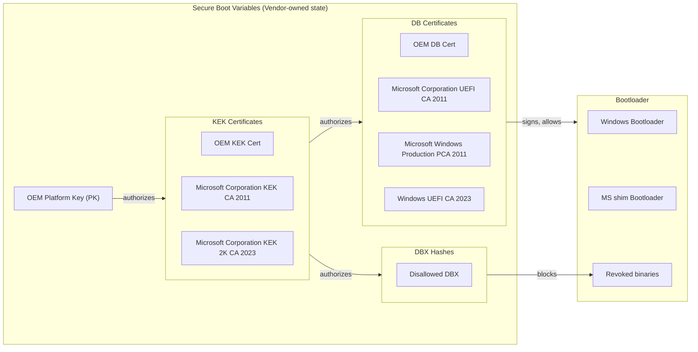
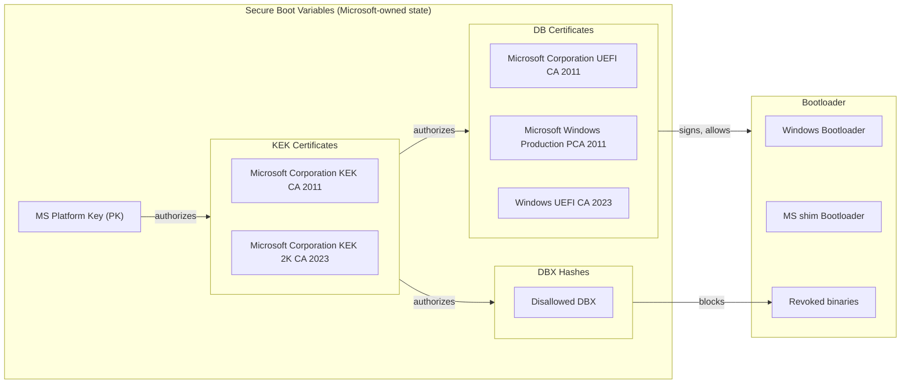
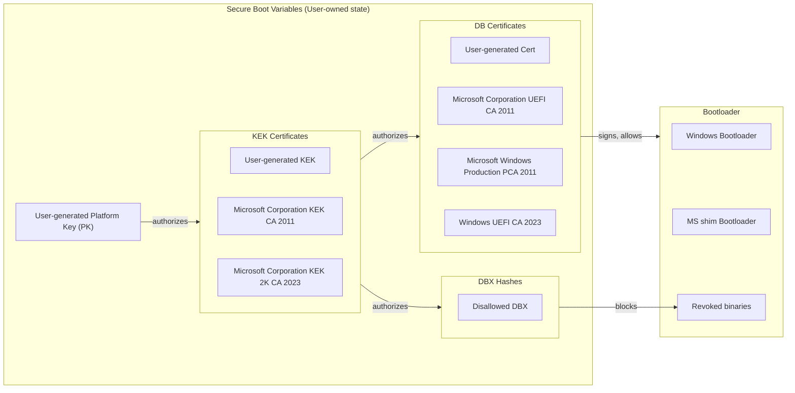

# SB-ENEMA 💊

**S**ecure **B**oot **E**mergency **N**uclear-option for **E**xasperated **M**otherboard **A**dministrators

Because sometimes your UEFI needs a deep cleaning. ¯\\\_(ツ)\_/¯

## What Is This?

A bootable USB image that audits, repairs, and re-provisions your UEFI Secure Boot variables (PK, KEK, db, dbx) when your vendor can't be bothered to ship firmware updates. Flash it, boot it, get on with your life.

**TL;DR:** Your motherboard vendor abandoned you. This is your revenge.

## Supported Scenarios

| Scenario | What SB-ENEMA Does |
|---|---|
| Vendor shipped a test PK | Will detect it, warn you, and offer replacement |
| Vendor never updated db/dbx | Will install current Microsoft db/dbx |
| You want full Secure Boot ownership | Will generate your own PK/KEK and enroll Microsoft db/dbx |
| You need a known-good Secure Boot chain | Will offer a Microsoft PK recovery mode |
| You just want to know if you're 2026-ready | Will run a health check and tell you |
| You wiped KEK/db and want vendor certs back | Will stage recognized OEM certs from KEKDefault/dbDefault |
| Windows user who can't boot a Linux USB | `SecureBootChecker.ps1` runs a full audit from a PowerShell prompt |

## ⚠️ Warnings and Safety Notes

Read this before doing anything. Seriously.

- **Changing PK/KEK/db/dbx _[will*](#bitlocker-tpm-and-why-this-matters)_ trigger BitLocker recovery.** Back up your BitLocker recovery key first. If you don't have it, stop here and go find it.
- **Credential Guard / VBS** may temporarily disable until the next reboot + re-attestation. This is expected.
- **OEM Secure Boot functionality** (vendor-specific features, OEM recovery partitions signed with vendor keys) may break unless you preserve the OEM KEK/db entries. Enthusiast motherboards almost never rely on these.
- **All changes are reversible** via your BIOS "Restore Factory Keys" option. If anything goes sideways, that's your escape hatch.
- Switching platform ownership is a deliberate, conscious action. The tool will preview exactly what will change before applying anything.

## Secure Boot Ownership Models

There are three Secure Boot ownership models you'll encounter in the wild. Understanding which one your system uses—and which one you *want*—is the whole point of this tool.

### Vendor-Owned (the default for consumer boards)




This is what ships on most consumer motherboards. The vendor controls the Platform Key. Microsoft's KEK is included so Windows and WHQL drivers work. In theory, the vendor updates db/dbx via firmware updates. In practice... well, you're here.

### Microsoft-Owned (Surface, enterprise, WHCP)



Used on Surface devices, Windows RT, WHCP test devices, and enterprise-managed hardware. Microsoft controls the whole chain. You probably don't have this unless you bought your machine from Microsoft or your IT department set it up.

### Custom-Owned (enthusiasts, security nerds)



You control the PK and KEK. Microsoft's db/dbx entries are enrolled under your KEK so Windows, WHQL drivers, and the UEFI shim bootloader still work. This gives you deterministic control over what boots on your hardware.

> **Important:** The PK private key is never stored on the target device—only in the EFI variables as a public certificate. If you generate a PK with this tool, the private key is saved to the FAT32 data partition on the USB drive. **Back it up.** If you lose it and need to modify your Secure Boot variables later, you'll need to re-enter Setup Mode and re-provision.

## BitLocker, TPM, and Why This Matters

This tool modifies Secure Boot variables (PK/KEK/DB/DBX). These changes may alter TPM PCR measurements, especially PCR 7 (Secure Boot policy), PCR 4 (boot manager), and PCR 0 (firmware). BitLocker protects its volume master key by sealing it to a specific PCR profile.

When the final PCR values differ from the values BitLocker previously sealed against, Windows may require a BitLocker recovery key on the next boot.

However, not all Secure Boot variable changes produce new PCR measurements. Many UEFI implementations measure only the effective Secure Boot state (e.g., SecureBootEnabled, SetupMode) rather than the raw contents of PK/KEK/DB. If the system returns to the same effective Secure Boot state after the change, the resulting PCR values may match the previous ones, and BitLocker will not prompt for recovery.

Additionally, once Windows completes a successful boot after a Secure Boot change, it may automatically re‑seal the BitLocker key to the new PCR profile. Subsequent reboots will then proceed without a recovery prompt.

In short: Secure Boot variable changes can trigger BitLocker recovery, but whether they do depends on the firmware’s PCR measurement behavior and whether Windows has already re‑sealed the TPM key.

**What to expect:**

1. You change PK/KEK/db/dbx (or update firmware—same effect).
2. On next Windows boot, BitLocker prompts for your recovery key.
3. You enter the recovery key. BitLocker re-seals to the new PCR values.
4. Subsequent boots work normally.
5. Credential Guard / VBS may show as disabled until Windows re-attests the new Secure Boot state. A reboot or two fixes this.

This is correct, expected behavior. Microsoft designed it this way. Don't panic.

## Recovery and Fallback Options

Things went wrong, or you changed your mind. Here are your options, from easiest to most drastic.

### A. Restore Factory Keys (OEM Defaults)

- Available in every UEFI BIOS under the Secure Boot settings.
- Restores the vendor's original PK/KEK/db/dbx.
- Use this if OEM tools, OEM recovery partitions, or firmware updates require vendor-specific keys.
- This is the "undo" button. It always works.

### B. Custom Secure Boot Ownership — "Full Colonic" (Recommended for Enthusiasts)

- Generates your own PK and KEK and enrolls Microsoft's db/dbx for Windows compatibility.
- The SB-ENEMA boot volume itself is re-signed with your new DB key so it can boot under Secure Boot on the next power-on.
- OEM-specific Secure Boot features may not work—but if you're building your own rigs, you almost certainly don't use them.
- The tool generates a fresh PK/KEK/DB key pair and stores the private keys on the USB drive. Back them up.

### C. Microsoft PK Recovery Mode — "Microsoft Colonic"

- Switches to: Microsoft PK → Microsoft KEK → Microsoft db/dbx.
- Produces a fully valid, standards-compliant Secure Boot chain.
- OEM-specific Secure Boot features may break (same as option B).
- BIOS firmware updates still work—they use a separate firmware-update signing key, not the Secure Boot chain.
- Reversible by restoring factory keys.
- Use this when the vendor PK is invalid, expired, or a known test key, and you don't want to manage your own keys.

### D. Add Missing Microsoft Entries — "Microsoft Suppository"

- Keeps your current PK. Adds missing Microsoft KEK/db/dbx to the firmware.
- Use this when your system already has a valid PK but is missing current Microsoft 2023 CA certificates or an up-to-date revocation list.

> ⚠️ Switching platform ownership is a deliberate action. The tool will show you exactly what it plans to do and ask for confirmation.

## 1.0 Feature Set

See [ROADMAP.md](ROADMAP.md) for the full breakdown. The short version:

- Detect invalid or test PKs
- Compare PK/KEK/db against known vendor defaults
- Validate whether the Secure Boot chain is 2026-ready
- Extract and display current Secure Boot configuration
- Warn when the vendor hasn't shipped updated firmware
- Help take ownership with custom PK/KEK/db
- Install Microsoft's db/dbx under your own KEK
- Secure Boot health report
- "What will change?" preview before applying anything
- Microsoft PK Recovery Mode with appropriate warnings
- Custom Owner Mode with deterministic PK/KEK/db generation
- "Restore OEM Defaults" reminder and instructions
- Stage recognized vendor OEM certs from firmware-preserved `KEKDefault`/`dbDefault` variables
- Self-sign the SB-ENEMA `BOOTX64.EFI` with your new DB key after Custom Owner Mode enrollment
- Windows Secure Boot health checker (`SecureBootChecker.ps1`) — no Linux required
- Audit firmware-preserved default variables (`PKDefault`, `KEKDefault`, `dbDefault`, `dbxDefault`) for 2026 readiness and regression risk

## Image Size

The raw `sb-enema.img` is ~140 MiB, yet it compresses to ~20 MiB. This is normal and intentional.

GPT disk images have fixed-size partitions. Both the EFI System Partition and the data partition are pre-allocated to a known size so that `dd` and Rufus can write the image directly to any USB stick without resizing. Unused space within each partition is zero-filled, which compresses extremely well.

| Partition | Raw size | Typical content |
|---|---|---|
| EFI System (`boot.vfat`) | 100 MiB | `BOOTX64.EFI` (kernel, ~12 MiB) + `rootfs.cpio.gz` (~15 MiB) |
| Data (`SB-ENEMA`) | 32 MiB | Secureboot payloads, generated keys, logs |

**Override partition sizes at build time:**

```sh
# Larger data partition (e.g. 128 MiB)
DATA_SIZE=128M make dist
```

**Produce a compressed image for distribution (ZIP – Windows-friendly):**

```sh
make dist
# Output: dist/sb-enema.zip  (~20 MiB, ZIP – extract and flash sb-enema.img)
# The raw .img is still usable directly with dd or Rufus.
```

## Quick Start

```sh
# Clone with submodules (the Microsoft certs live there)
git clone --recursive https://github.com/mcfbytes/sb-enema.git
cd sb-enema

# Build (requires: curl, openssl, mkfs.fat, rsync, sudo, python3-venv)
make dist

# Output lands in dist/sb-enema.img
```

## Flashing

**Rufus (Windows):**
1. Select `sb-enema.img`
2. Partition scheme: GPT
3. Target system: UEFI (non-CSM)
4. Start, wait, done

**dd (Linux/macOS):**
```sh
sudo dd if=output/br-out/images/sb-enema.img of=/dev/sdX bs=4M status=progress && sync
```

## Usage

1. **Back up your BitLocker recovery key.** (Settings → Update & Security → Device encryption, or `manage-bde -protectors -get C:`, or check your Microsoft account.)
2. Put target machine into UEFI **Setup Mode** (Secure Boot settings → "Clear Keys" / "Reset to Setup Mode").
3. Boot from the USB.
4. Follow the on-screen prompts. Review the "What will change?" summary.
5. Reboot into your now-secured system.
6. Enter your BitLocker recovery key when prompted. It re-seals automatically.
7. Send a polite email to your vendor asking why *you* had to do this.

## Project Structure

```
├── Makefile                    # Wrapper for Buildroot build
├── SecureBootChecker.ps1       # Windows-native Secure Boot health checker
├── sb_enema/                   # Buildroot external tree (configs, overlays, packages)
│   ├── configs/                # Buildroot defconfig (minimal x86_64 Linux)
│   ├── package/                # Custom packages (efitools, sbsigntools)
│   └── board/sb-enema/
│       └── rootfs-overlay/usr/
│           ├── sbin/
│           │   └── sb-enema                # Main runtime entry point (menu + CLI)
│           └── lib/sb-enema/
│               ├── audit.sh                # Secure Boot health audit engine
│               ├── report.sh               # Health report renderer
│               ├── preview.sh              # Change preview & user confirmation
│               ├── update.sh               # Delta computation (ADD/REMOVE/KEEP)
│               ├── stage.sh                # Staging functions (PK/KEK/db/dbx payloads)
│               ├── enroll.sh               # Generic enrollment (applies staged payloads)
│               ├── keygen.sh               # Key generation, GUID management, backup instructions
│               ├── safety.sh               # Safety guardrails (Setup Mode, payload integrity)
│               ├── certdb.sh               # Certificate fingerprint lookups
│               ├── efivar.sh               # EFI variable I/O (including KEKDefault/dbDefault)
│               ├── mount.sh                # Partition mount helpers
│               ├── log.sh                  # Structured logging
│               ├── common.sh               # Shared constants & helpers
│               └── known-certs/            # Certificate fingerprint databases
├── scripts/                    # Build-time helpers (payload prep, test scripts)
├── third_party/
│   └── secureboot_objects/     # Microsoft reference certs/templates (submodule)
└── docs/                       # Detailed architecture & usage docs
```

## How It Works

This is a [Buildroot](https://buildroot.org/)-based project that builds a minimal Linux environment containing `efitools` for UEFI variable manipulation. The build process:

1. Pulls Microsoft's `secureboot_objects` repo (templates, scripts, pre-signed objects)
2. Generates firmware payloads (PK/KEK/db/dbx) using Microsoft's Python tooling
3. Packages everything into a hybrid GPT image with:
   - FAT32 EFI boot partition (kernel, initramfs)
   - FAT32 data partition (certs, payloads, logs, generated private keys)

At runtime:

1. Automatically logs in as root and runs `sb-enema` (via `/root/.profile`).
2. The FAT32 data partition is mounted at `/mnt/data` before `sb-enema` starts.
3. Audits current Secure Boot state: identifies test PKs, validates certificate expiry, checks 2026 readiness
4. Identifies the current ownership model (vendor-owned, Microsoft-owned, custom, or test)
5. Renders a health report with per-certificate status and severity-graded findings
6. For any provisioning operation: computes the delta (what will be added/removed/kept per variable), shows a preview, and requires explicit confirmation before touching anything
7. Applies variables in the correct order (db → dbx → KEK → PK) using `efi-updatevar`
8. Logs every action with timestamps to the USB drive

All generated private keys stay on the FAT32 data partition. They never touch the target system.

## Requirements

**Build host:**
- `curl`, `tar`, `git`
- `openssl`
- `mkfs.fat` (from `dosfstools`)
- `rsync`, `sudo`
- `python3-venv`

**Target system:**
- x86_64 UEFI with Secure Boot support
- Must be in **Setup Mode** (keys cleared)

## Contributing

Found a bug? Have a vendor horror story? PRs welcome.

## License

MIT. See [LICENSE](LICENSE).

## Acknowledgments

- [Buildroot](https://buildroot.org/) — for making embedded Linux tolerable
- [Microsoft secureboot_objects](https://github.com/microsoft/secureboot_objects) — ironically, Microsoft maintains better Secure Boot tooling than most motherboard vendors
- Every forum post from 2015 explaining how to manually enroll keys — we've all been there

---

*"My vendor's last firmware update was during the Obama administration."* — Anonymous SB-ENEMA user
